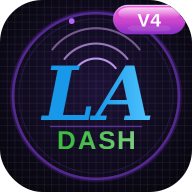

# 學習分析儀表板 · Learning Analytics Dashboard

<!-- PROJECT SHIELDS -->

[](LICENSE)
[](https://web.dev/progressive-web-apps/)
[](#安全性架構)
[](https://www.chartjs.org/)
[](https://d3js.org/)

<!-- PROJECT LOGO -->
<br />

<p align="center">
  <a href="#">
    
  </a>

  <h3 align="center">學習分析儀表板 · LA DASH</h3>
  <p align="center">
    以學習行為資料為基礎的互動式分析工具，支援多學期、多學制課程之學習模式視覺化與高風險學生預警。
    <br />
    純前端 PWA（HTML + Vanilla JS），可部署至 GitHub Pages，無需後端伺服器。
    <br />
    <br />
    <a href="#"><strong>探索文件 »</strong></a>
    <br />
    <br />
    <a href="#issues">回報 Bug</a>
    ·
    <a href="#issues">提出新功能</a>
  </p>
</p>

---

## 目錄

- [功能概覽](#功能概覽)
- [專案結構](#專案結構)
- [技術架構](#技術架構)
- [安全性架構](#安全性架構)
- [資料準備](#資料準備)
- [本機執行](#本機執行)
- [部署至 GitHub Pages](#部署至-github-pages)
- [篩選維度](#篩選維度)
- [PWA 安裝](#pwa-安裝)
- [版本控制](#版本控制)
- [授權](#授權)

---

## 功能概覽

### 主面板

| 面板 | ID | 說明 |
|------|----|------|
| 成績總覽 | `panelD` | 跨學期趨勢、各學制成績比較、及格率、熱圖、箱型圖、班級明細表 |
| 單班分析 | `panelA` | 班級成績分布、期中期末、歷年趨勢、常態疊圖、迴歸、變異分析 |
| 學生／重修 | `panelC` | 全體學生分布、異常密度、重修前後斜率圖、象限分析、改善幅度 |
| 行為分析 | `panelL` | 六個子分頁（詳見下表） |
| 高風險報告 | `panelR` | 紅旗警示、處方性建議、PDF 匯出 |
| 列印 | `panelP` | 多圖表選擇列印預覽、另存 PDF |

### 行為分析子分頁（`panelL`）

| 子分頁 | Tab label | 說明 |
|--------|-----------|------|
| 雷達圖 | `L 行為雷達` | 各學制學生學習行為雷達圖比較 |
| 相關性矩陣 | `L 行為關聯` | 學習行為指標間 Pearson 相關熱力圖 + 散點圖 |
| 時序分析 | `L 時間行為` | 週別學習趨勢、考前學習時間、時段分布、24h 熱圖 |
| LSA 序列分析 | `L LSA` | 學習行為序列有向圖（D3.js 力導向）、S-cluster 分組 |
| 跨屆比較 | `L 交叉分析` | 行為群組與成績、行為軌跡、學習策略跨屆比較 |
| 早期預警 | `L 預警` | Option B 14 天後驗證預警系統（BAS / QMI 風險分層） |

---

## 專案結構

```
.
├── index.html                        # 主應用程式（單頁）
├── manifest.json                     # PWA Manifest
├── sw.js                             # Service Worker（根目錄，確保 scope 正確）
├── js/
│   ├── main.js                       # 主應用邏輯、Panel A/C/D 渲染、escapeHtml/safeSvgAttr/normalizeChartThemeColors
│   ├── behavior-init.js              # 行為資料初始化（協調 Panel L 各子分頁啟動）
│   ├── behavior-loader.js            # 資料載入 v3.0（LRU 快取、masked_id join、gz 回退）
│   ├── filter-engine.js              # 篩選器核心邏輯 v1.1.0（無 DOM 依賴）
│   ├── chart-registry.js             # Chart 實例集中註冊與銷毀管理
│   ├── at-risk-report.js             # 高風險報告管理器（Panel R）
│   ├── frame-guard.js                # iframe 嵌入防護（同步載入，無 defer）
│   ├── print-panel.js                # 列印面板（Panel P）多圖表選擇與預覽
│   ├── ui-toggles.js                 # 通用 UI 互動（popover、toggle、深淺色切換）
│   ├── tab-behavior-radar.js         # Panel L › 雷達圖子分頁
│   ├── tab-behavior-correlation.js   # Panel L › 相關性矩陣子分頁
│   ├── tab-behavior-time.js          # Panel L › 時序折線圖子分頁
│   ├── tab-behavior-lsa.js           # Panel L › LSA 序列有向圖子分頁
│   ├── tab-behavior-cross.js         # Panel L › 跨屆比較子分頁
│   ├── tab-behavior-warning.js       # Panel L › 早期預警子分頁（Option B）
│   └── vendor/
│       ├── chart.umd.min.js          # Chart.js 4.4.0
│       ├── chartjs-plugin-annotation.min.js  # @3.0.1
│       ├── d3.min.js                 # D3.js v7.9.0（LSA 有向圖）
│       └── pwacompat.min.js          # PWACompat（iOS Splash Screen 自動產生）
├── icons/                            # PWA 圖示（192、512、180、167、120 px）
└── data/                             # 資料目錄（需自行提供，含個資請自行管理）
    ├── scores.json                   # 成績資料（Panel A/C/D）
    ├── behavior.json                 # 行為資料主檔
    ├── radar_chart_data.json
    ├── correlation_matrix.json
    ├── quiz_behavior.json
    ├── time_distribution.json
    ├── lsa_transition.json           # LSA 序列轉移矩陣（10_lsa_transition.py 產出）
    └── at_risk_profile.json          # schema_version ≥ 3.0（by_semester 結構）
```

---

## 技術架構

- **前端**：純 HTML + Vanilla JS，無前端框架依賴
- **圖表**：[Chart.js 4.4.0](https://www.chartjs.org/) + chartjs-plugin-annotation 3.0.1（本地化於 `js/vendor/`）
- **有向圖**：[D3.js v7.9.0](https://d3js.org/)（本地化，供 LSA 序列有向圖使用）
- **PWA**：Service Worker（App Shell Cache First + Data Network First）、iOS / Android / 桌機安裝支援
- **資料層**：`behavior-loader.js` v3.0 負責 lazy load JSON（LRU 快取、gz 壓縮回退）；`filter-engine.js` v1.1.0 處理多維度篩選邏輯（無 DOM 依賴）
- **圖表生命週期**：`chart-registry.js` 集中管理所有 Chart.js 實例的建立與銷毀，避免記憶體洩漏
- **離線支援**：斷線時自動回退至最近快取的 data JSON
- **快取版本**：`la-dash-v5`（於 `sw.js` 管理，更新時遞增）

---

## 安全性架構

### Content Security Policy（CSP）

**目前 CSP 設定（`index.html` `<meta http-equiv>`）：**

```
default-src 'self';
script-src  'self';
style-src   'self' 'nonce-{random}';
img-src     'self' data: blob:;
connect-src 'self';
font-src    'self' data:;
worker-src  'self' blob:;
```

> ✅ `style-src` 已完全移除 `'unsafe-inline'`，改採 **nonce + `adoptedStyleSheets`** 雙策略：
>
> | 動態樣式類型 | 合規方式 |
> |-------------|---------|
> | `<style>` 節點注入（主題、列印、自適應樣式） | `element.textContent = css` + `element.setAttribute('nonce', nonce)` |
> | 高頻率狀態切換（display、color、width 等） | `element.style.setProperty('prop', value)` |
> | 複合樣式區塊（多屬性一次套用） | `CSSStyleSheet.replace()` + `document.adoptedStyleSheets` 優先，降級為 nonce `<style>` |
>
> ⚠️ **GitHub Pages 限制**：`<meta>` CSP 的 nonce 無法在伺服器端動態產生，實際部署時 nonce 值固定。如需完整 nonce 防護，建議改用 Cloudflare Pages 並透過 Worker 或 `_headers` 注入動態 nonce。
>
> ⚠️ Note: Chart.js 透過 JS DOM property 設定樣式，**不受 `style-src` 管控**。本專案以 `normalizeChartThemeColors()` 於繪圖前統一解析 CSS var（`getComputedStyle`），確保圖表色彩正確呈現。

> ⚠️ **GitHub Pages 限制**：`<meta>` CSP 不支援 `frame-ancestors` 指令。本專案以 `js/frame-guard.js`（同步載入，無 `defer`）作為替代方案，在渲染前偵測 iframe 嵌入並強制跳出至頂層視窗，等效於 `X-Frame-Options: SAMEORIGIN`。

### XSS 防護

- 所有動態 HTML 插值一律通過 `escapeHtml()` / `safeSvgAttr()` / `escapeAttr()`（定義於 `main.js` / `print-panel.js`）處理
- 禁止使用 `innerHTML` 傳入未逸出的使用者資料；清空用途（`innerHTML = ''`）例外
- 無 `eval()`、無 `document.write()`、無 `new Function()`
- 學生識別碼一律使用 SHA-256 salt 雜湊後的 `name_masked`，原始姓名不進入前端

### CSP 合規稽核記錄（V12 → V15）

| 版本 | 修復項目 |
|------|---------|
| V13 | BUG-1：`renderDTable` 閉括號錯位修復；BUG-2：`populateCYearFilter` 雜入呼叫清除；全域 74 處 `.style.xxx =` 轉為 `setProperty` |
| V14 | 移除 5 處 `console.debug` 垃圾碼 |
| V15 | 窮舉式稽核（9 類 CSP 違規 / 6 類 Bug / 9 類垃圾碼）全數通過；移除殘留 `console.info` |

### 建議伺服器安全標頭（CDN 層設定）

| 標頭 | 建議值 |
|------|--------|
| `X-Frame-Options` | `SAMEORIGIN` |
| `Referrer-Policy` | `strict-origin-when-cross-origin` |
| `Permissions-Policy` | `camera=(), microphone=(), geolocation=()` |

---

## 資料準備

`data/` 目錄下的 JSON 檔案需由後端 ETL 流程產出，**不隨本 repo 提供**（含個資，請自行管理）。

- `at_risk_profile.json` 須符合 schema version ≥ 3.0（`by_semester` 多學期結構）
- `lsa_transition.json` 由 `10_lsa_transition.py` 產出，包含 `by_cluster` 與 `by_lsa_type` 兩種分組

---

## 本機執行

###### 環境需求

1. Node.js（用於 `npx serve`）或 Python 3.x（擇一即可）
2. 已備妥 `data/` 目錄下的 JSON 資料檔

###### 啟動步驟

1. Clone 本 repo

```sh
git clone #.git
cd la-dash
```

2. 啟動本機靜態伺服器

```sh
# 方式一：Node.js
npx serve .

# 方式二：Python
python -m http.server 8080
```

3. 瀏覽器開啟 `http://localhost:8080`

> ⚠️ 直接以 `file://` 開啟會因 CORS 限制無法載入 JSON，請務必透過本機伺服器。

---

## 部署至 GitHub Pages

1. 將 `data/` 目錄加入 `.gitignore`，避免個資外洩
2. 於 repo 的 **Settings → Pages** 設定來源分支
3. `frame-ancestors` / `X-Frame-Options` 由 `frame-guard.js` 替代防護（GitHub Pages 不支援自訂 HTTP 標頭）
4. 如需動態 nonce CSP 或完整伺服器層安全標頭，建議改用 [Cloudflare Pages](https://pages.cloudflare.com/)（支援 `_headers` 及 Worker）

---

## 篩選維度

`filter-engine.js` v1.1.0 支援以下篩選規則（依規格書 v3.1）：

- **學期** → 自動反灰不適用學制
- **學制**：二技一般、二技在職、二技夜間、四技一般、學士後護、重修班、重修生
- **課程類型** → 依學制鎖定可選項目
- **班級** → 動態依前述選項產生清單
- **重修生開關**：可單獨切換是否納入統計

---

## PWA 安裝

| 平台 | 步驟 |
|------|------|
| iOS Safari | 分享 → 加入主畫面 |
| Android Chrome | 網址列右側「安裝」按鈕 |
| 桌機 Chrome/Edge | 網址列右側安裝圖示 |

---

## 版本控制

本專案使用 Git 進行版本管理。JS 模組採內部版號追蹤（`filter-engine.js` v1.1.0、`behavior-loader.js` v3.0），Service Worker 快取以 `la-dash-v5` 命名管理。

---

## 授權

本專案為某科大內部教學研究用途，資料集不對外公開。程式碼部分採 MIT 授權，詳見 [LICENSE](LICENSE)。

---

## 鳴謝

- [Chart.js](https://www.chartjs.org)
- [D3.js](https://d3js.org)
- [GitHub Pages](https://pages.github.com)
- [Cloudflare Pages](https://pages.cloudflare.com)
- [PWACompat](https://github.com/GoogleChromeLabs/pwacompat)
- [Img Shields](https://shields.io)
